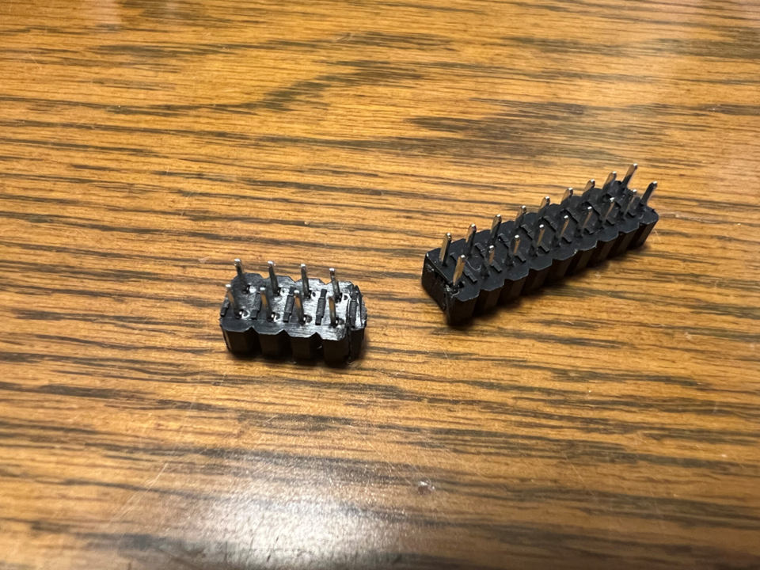

# ALGYAN 7th IoT基板はんだ付けマニュアル

---

## <a name="S0">0. Index</a>

* [事前準備](#S-0)
  * [S-1 道具の確認](#S-1)
  * [S-2 部品の確認](#S-2)
* [1. 部品のはんだ付け](＃1)
  * [1-1. Set A(お手軽)](#1-1)
  * [1-2. Set B(手作りFULL)](#1-2)
    * [1-2-1. USBシリアルIC(U3)](#1-2-1)
    * [1-2-2. microUSBコネクタ(CN4USB)](#1-2-2)
    * [1-2-3. FRAM(2Mbit) MB85RS2MT (U5、U6)](#1-2-3)
    * [1-2-4. チップLED(LED1、PWR、TXD、RXD)](#1-2-4)
    * [1-2-5. チップ抵抗(R22、R23)](#1-2-5)
    * [1-2-6. チップ抵抗(R1、R2、R6、R7、R8、R9、R11、R12、R13、R14、R15、R16、R17、R18、R19、R20)](#1-2-6)
    * [1-2-7. チップ抵抗(R3、R4、R5、R10、R21)](#1-2-7)
    * [1-2-8. チップトランジスタ(T1、T2)](#1-2-8)
    * [1-2-9. チップコンデンサ(C3、C5、C7、C8、C9、C10、C11、C12、C13、C14)](#1-2-9)
    * [1-2-10. チップコンデンサ(C4、C6)](#1-2-10)
    * [1-2-11. チップコンデンサ(C1、C2)](#1-2-11)
    * [1-2-12. Quad Bus Buffer　TC74VHC125F、TC74VHC126F(U8、U9)](#1-2-12)
    * [1-2-13. 3端子レギュレーター(U2)](#1-2-13)
    * [1-2-14. Wi-Fiモジュール ESP32-WROOM-32D(U1)](#1-2-14)
    * [1-2-15. 表面実装タクトスイッチ(SW、EN、BOOT)](#1-2-15)
    * [1-2-16. I/Oエキスパンダー PCF8574N (U7)](#1-2-16)
    * [1-2-17. 2.2" ILI9341 SPI TFT LCDディスプレイ (U10)](#1-2-17)
    * [1-2-18. エレクトレットコンデンサーマイク(C9767) (U11)](#1-2-18)
    * [1-2-19. Groveコネクタ　Ｌ型 (CN5、CN6、CN7)](#1-2-19)
    * [1-2-20. L型ピンヘッダ3Pin (CN1)](#1-2-20)
    * [1-2-21. 3.5mm小型ステレオミニジャック (CN2)](#1-2-21)
    * [1-2-22. CMOS OV7670 640x480 カメラモジュール (CAM1)](#1-2-22)
    * [1-2-23. USB Type-CコネクタDIP化キット (CN3USB)](#1-2-23)
* [2. 動作確認](#2)

---
## <a name="S-0">事前準備</a>

まずは、ALGYAN7th IoT基板に電子部品をはんだ付けして完成させるために必要な準備を行います。

### <a name="S-1">S-1 道具の確認</a>

#### ・必要なもの(道具)

1. はんだごて - 先の細い20W～30W程度の電子部品はんだ付け用
1. こて台
1. やに入りはんだ線 - できるだけ細いものを推奨(できればΦ0.4mmぐらい、Φ0.6mm以下)
1. ピンセット - 先の尖ったもの
1. はんだ吸い取り線
1. [フラックスペン](https://www.amazon.co.jp/dp/B00SKSJFZA)
1. ニッパ
1. ルーペ

#### ・その他あると良いもの(道具)
  * ルーペ付き作業台  
  * M2.6スペーサー(10mm以上オスメス)、ビス各4本
  * [フラックスクリーナー](https://www.amazon.co.jp/dp/B003B36VWY/)

[↑ Back to Index](#S0)

---

### <a name="S-2">S-2 部品の確認</a>

* "ALGYAN-7th_board_parts_list_setA.pdf" もしくは"ALGYAN-7th_board_parts_list_setB.pdf"を印刷して、パーツに不足がないか確認をしましょう。
  * 左下の番号ははんだ付けの順序になります。
  * 極性のある部品については、このリスト上に「極性注意」の赤字で記載もしています。
    * セットA(お手軽)： [ALGYAN-7th_board_parts_list_setA.pdf](ALGYAN-7th_board_parts_list_setA.pdf)

    * セットB(手作りFULL)：[ALGYAN-7th_board_parts_list_setB.pdf](ALGYAN-7th_board_parts_list_setB.pdf)

[↑ Back to Index](#S0)

---

#### ・パーツSet A(お手軽)一式を並べた状態

#### ・Set B(手作りFULL)一式を並べた状態

ピンヘッダ、ピンソケットは購入したままではなく、利用するピン数に合わせて、切り折る必要があるものがあります。  

[↑ Back to Index](#S0)

---

## <a name="1">1. 部品のはんだ付け</a>

部品のはんだ付けは、高さが低く、小さな部品から、また同じ種類、型式のものをまとめて行っていくと間違いが少なくできます。  
目安として、パーツリストの各部品欄左下の番号順(Set Aは、①～⑰、Set Bは①～㉔)に部品をはんだ付けしていく形になります。  
また、今回の基板は金メッキ基板のため、チップ部品のはんだ付けには必ずランド(※)に予備はんだが必要になります。  

※)ランドとは、部品の取り付け及び接続に用いる導体パターンのことです。  
　表面実装用の場合は「パッド」と呼ぶこともあります。  

### <a name="1-1">1-1. Set A(お手軽)</a>
準備が間に合いませんでした。後日、公開します。  
(本日は、もくもく会での実演もしくは、手作りFULLの手順を参照して行って下さい。)  

[↑ Back to Index](#S0)

---

### <a name="1-2">1-2. Set B(手作りFULL)</a>
#### <a name="1-2-1">1-2-1. USBシリアルIC(U3)</a>
USBシリアルIC(U3)には、方向があります。  
下の写真のように1番ピンの場所にマークがついています。  

USBシリアルIC(U3)のはんだ付けにおいては、20ピンのランド(※)の内、1つのランド(1番ピンのランド)に予備はんだを盛ります。  
予備はんだを盛るランドは、コーナーやその近くでGNDのようなベタパターンと繋がっていない方に行います。  
(ベタパターンと繋がっているランドには、はんだごての熱が伝わりにくく、はんだがのりにくいので避けます。)  

予備はんだを盛った1番ピンランドにICの1番ピンを合わせはんだ付けします。  
最初は、予備はんだを付けたランドにICをピンセットで摘まんで、位置を合わせて予備はんだをこてで溶かして取り付けます。  
次に対角のランドのはんだ付けをします。  
はんだ付けのコツは、まずこてで基板のランドを1、2秒ぐらい温めます。
その後、はんだを流してつけます。  

最後に残りのランドのはんだ付けをします。  
はんだ付けでピン間をショートさせてしまった場合は、はんだ吸い取り線などで余分なはんだを取り除いてフラックスを塗り、ピン間をこてで切るようにするとショートを解消できたりします。  

[↑ Back to Index](#S0)

---

#### <a name="1-2-2">1-2-2. microUSBコネクタ(CN4USB)</a>
microUSBコネクタのはんだ付けにおいては、同様に1つのランド(1番ピンのランド)に予備はんだを盛ります。  

その上で、全ピンの位置を慎重に合わせ、信号線部分のはんだ付けを行います。  
ここでもはんだ付けでピン間をショートさせてしまった場合は、はんだ吸い取り線などで余分なはんだを取り除いてフラックスを塗り、ピン間をこてで切るようにするとショートを解消できたりします。  
最後にコネクタのフレーム部分の周り4箇所のはんだ付けを行います。  
(フレーム部分のはんだ受けは強度を出すためにはんだを少し多めにします。)

[↑ Back to Index](#S0)

---

#### <a name="1-2-3">1-2-3. FRAM(2Mbit) MB85RS2MT (U5、U6)</a>
FRAM(2Mbit) MB85RS2MT (U5、U6)を直接はんだ付けする場合は、はんだ付けする向きに注意して、同様に1つのランド(1番ピンのランド)に予備はんだを盛ります。  

最初は、予備はんだを付けたランドにICをピンセットで摘まんで、位置を合わせて予備はんだをこてで溶かして取り付けます。  
次に対角のランドのはんだ付けをします。  

最後に残りのランドのはんだ付けをします。  
はんだ付けでピン間をショートさせてしまった場合は、はんだ吸い取り線などで余分なはんだを取り除いてフラックスを塗り、ピン間をこてで切るようにするとショートを解消できたりします。  

[↑ Back to Index](#S0)

---

#### <a name="1-2-4">1-2-4. チップLED(LED1、PWR、TXD、RXD)</a>
チップLED(LED1、PWR、TXD、RXD)には、方向があります。  
下の写真のようにカソード側にマークがついています。  

チップLED(LED1、PWR、TXD、RXD)のはんだ付けにおいては、片側のランドに予備はんだを盛ります。  
予備はんだを盛るランドは、GNDのようなベタパターンと繋がっていない方に行います。  
(ベタパターンと繋がっているランドには、はんだごての熱が伝わりにくく、はんだがのりにくいので避けます。)  
カソードが基板の外側に来る(写真の)ようにはんだ付けします。  
最初は、予備はんだを付けたランドにLEDをピンセットで摘まんで、位置を合わせて予備はんだをこてで溶かして取り付けます。  
  

[↑ Back to Index](#S0)

---

#### <a name="1-2-5">1-2-5. チップ抵抗(R22、R23)</a>
チップ抵抗には、表と裏があります。3桁の数字が書いてある黒い面が表で、白い面は裏です。  
表裏を逆にはんだ付けしても、動作には影響ありませんが、表面が見えるようにはんだ付けしましょう。  
片側のはんだ付けが出来たら、反対側をはんだ付けします。  

以下の写真は、チップ抵抗(R22、R23)のはんだ付けが終わった状態です。  

[↑ Back to Index](#S0)

---

#### <a name="1-2-6">1-2-6. チップ抵抗(R1、R2、R6、R7、R8、R9、R11、R12、R13、R14、R15、R16、R17、R18、R19、R20)</a>
チップ抵抗(R1、R2、R6、R7、R8、R9、R11、R12、R13、R14、R15、R16、R17、R18、R19、R20)も、抵抗値を間違えないように、注意し同様にはんだ付けを行います。

[↑ Back to Index](#S0)

---

#### <a name="1-2-7">1-2-7. チップ抵抗(R3、R4、R5、R10、R21)</a>
チップ抵抗(R3、R4、R5、R10、R21)も、抵抗値を間違えないように、注意し同様にはんだ付けを行います。

[↑ Back to Index](#S0)

---

#### <a name="1-2-8">1-2-8. チップトランジスタ(T1、T2)</a>
以下の写真は、チップトランジスタ(T1、T2)のはんだ付けが終わった状態です。  
チップトランジスタ(T1、T2)も同様にはんだ付けを行います。

[↑ Back to Index](#S0)

---

#### <a name="1-2-9">1-2-9. チップコンデンサ(C3、C5、C7、C8、C9、C10、C11、C12、C13、C14)</a>
以下の写真は、チップコンデンサのはんだ付けが終わった状態です。  
チップコンデンサ(C3、C5、C7、C8、C9、C10、C11、C12、C13、C14)も同様にはんだ付けを行います。
(チップサイズはセットにより写真と異なる場合があります。)

[↑ Back to Index](#S0)

---

#### <a name="1-2-10">1-2-10. チップコンデンサ(C4、C6)</a>
以下の写真は、チップコンデンサのはんだ付けが終わった状態です。  
チップコンデンサ(C4、C6)も同様にはんだ付けを行います。
これも、容量を間違えないように、注意し同様にはんだ付けを行います。
(チップサイズはセットにより写真と異なる場合があります。)

[↑ Back to Index](#S0)

---
#### <a name="1-2-11">1-2-11. チップコンデンサ(C1、C2)</a>
以下の写真は、チップコンデンサのはんだ付けが終わった状態です。  
チップコンデンサ(C1、C2)も同様にはんだ付けを行います。

[↑ Back to Index](#S0)

---
#### <a name="1-2-12">1-2-12. Quad Bus Buffer　TC74VHC125F、TC74VHC126F(U8、U9)</a>
Quad Bus Buffer　TC74VHC125F、TC74VHC126F(U8、U9)には、方向があります。  
下の写真のように1番ピンの側にマークがついています。  

Quad Bus Buffer　TC74VHC125F、TC74VHC126F(U8、U9)のはんだ付けにおいては、14ピンのランド(※)の内、1つのランド(1番ピンのランド)に予備はんだを盛ります。  
予備はんだを盛るランドは、コーナーやその近くでGNDのようなベタパターンと繋がっていない方に行います。  
(ベタパターンと繋がっているランドには、はんだごての熱が伝わりにくく、はんだがのりにくいので避けます。)  

予備はんだを盛った1番ピンランドにICの1番ピンを合わせはんだ付けします。  
最初は、予備はんだを付けたランドにICをピンセットで摘まんで、位置を合わせて予備はんだをこてで溶かして取り付けます。  
次に対角のランドのはんだ付けをします。  
はんだ付けのコツは、まずこてで基板のランドを1、2秒ぐらい温めます。
その後、はんだを流してつけます。  

最後に残りのランドのはんだ付けをします。  
はんだ付けでピン間をショートさせてしまった場合は、はんだ吸い取り線などで余分なはんだを取り除いてフラックスを塗り、ピン間をこてで切るようにするとショートを解消できたりします。  

[↑ Back to Index](#S0)

---
#### <a name="1-2-13">1-2-13. 3端子レギュレーター(U2)</a>

[↑ Back to Index](#S0)

---

#### <a name="1-2-14">1-2-14. Wi-Fiモジュール ESP32-WROOM-32D(U1)</a>
次は大物のWi-Fiモジュール ESP32-WROOM-32D(U1)のはんだ付けです。
これも、チップ抵抗と同様に予備はんだを盛りますが、盛る場所はまずGNDに繋がるピンを避け、角に近い1ピン、25ピンの2ヶ所にして、位置がずれないように注意しながらはんだ付けして行きます。  

位置ずれなく、2ヶ所のピンのはんだ付けが出来たら、残りのピンをはんだ付けしていきます。  
このモジュールのはんだ付けには、[フラックスペン](https://www.amazon.co.jp/dp/B00SKSJFZA)を使うと綺麗に出来上がります。  

[↑ Back to Index](#S0)

---
#### <a name="1-2-15">1-2-15. 表面実装タクトスイッチ(SW、EN、BOOT)</a>
表面実装タクトスイッチ(SW、EN、BOOT)は、裏面に小さなピンが出ています。  
このピンを基板の穴に嵌められるため、**予備はんだをせずにはんだ付け**を行います。  

以下の写真は、表面実装タクトスイッチ(SW3)までのはんだ付けが終わった状態です。

[↑ Back to Index](#S0)

---

#### <a name="1-2-16">1-2-16. I/Oエキスパンダー PCF8574N (U7)</a>
I/Oエキスパンダー PCF8574N (U7)は、DIP16Pinパッケージになります。  

パッケージの向きに注意して穴にICを装着し、裏側に出た足を内側に少し折り曲げ、はずれないようにします。  
その後、裏から全ピンのはんだ付けをします。  

[↑ Back to Index](#S0)

---

#### <a name="1-2-17">1-2-17. 2.2" ILI9341 SPI TFT LCDディスプレイ (U10)</a>
2.2" ILI9341 SPI TFT LCDディスプレイ (U10)のSDカードI/F側には、ピンヘッダが装着されていません。  
また購入部品には、6pinのピンヘッダしかないため、このピンヘッダを5Pinに加工してはんだ付けします。  

その後、両サイドのピンヘッダにピンソケットを差し、四隅の穴にプラスチックスペーサを取り付けた状態で、基板の裏側から、ピンソケットのはんだ付けをします。

[↑ Back to Index](#S0)

---

#### <a name="1-2-18">1-2-18. エレクトレットコンデンサーマイク(C9767) (U11)</a>
エレクトレットコンデンサーマイク(C9767) (U11)は、極性があります。  
また、このトイカメラの前側、後ろ側のどちらかに装着できるようになっています。  

いずれの場合も、基板のシルクに合わせて装着すると、極性を間違えないようにしています。

[↑ Back to Index](#S0)

---

#### <a name="1-2-19">1-2-19. Groveコネクタ　Ｌ型 (CN5、CN6、CN7)</a>
Groveコネクタは、シルクの形状(写真の向き)に合わせ嵌めて、はんだ付けします。  
このときも各1本のピンだけはんだ付けが終わったところで、基板からコネクタが浮いていないか、曲がっていないかを確認します。  
浮いていたり、曲がっていたらこのときに修正します。  
1本のピンのはんだ付けに問題なければ、残りのピンのはんだ付けをします。  

GroveコネクタCN6でI2C通信をする場合は、さらに基板裏側のSJ1、SJ2の片側をはんだ付けしてショートさせる必要があります。  
以下の写真の場合は、GroveコネクタCN6でI2C通信をする場合のパターンショートの例です。  
GroveコネクタCN6でIO入出力(P6/P7)をする場合は、反対側をショートさせます。

[↑ Back to Index](#S0)

---

#### <a name="1-2-20">1-2-20. L型ピンヘッダ3Pin (CN1)</a>
L型ピンヘッダ3Pinは、シルクの形状(写真の向き)に合わせ嵌めて、はんだ付けします。  
このときも各1本のピンだけはんだ付けが終わったところで、基板からコネクタが浮いていないか、曲がっていないかを確認します。  
浮いていたり、曲がっていたらこのときに修正します。  
1本のピンのはんだ付けに問題なければ、残りのピンのはんだ付けをします。  

[↑ Back to Index](#S0)

---

#### <a name="1-2-21">1-2-21. 3.5mm小型ステレオミニジャック (CN2)</a>
3.5mm小型ステレオミニジャックも、シルクの形状(前の写真の向き)に合わせ嵌めて、はんだ付けします。  

[↑ Back to Index](#S0)

---

#### <a name="1-2-22">1-2-22. CMOS OV7670 640x480 カメラモジュール (CAM1)</a>
CMOS OV7670 640x480 カメラモジュール (CAM1)用に購入したピンソケットは、2x13pinのもので、ピン数が一致していません。  
このため、このピンヘッダを2x9pinに加工してはんだ付けします。  
このピンソケットの加工は少し難しいので、注意して行って下さい。

その後、OV7670のピンヘッダにピンソケットを差し、四隅の穴にプラスチックスペーサを取り付けた状態で、基板の裏側に装着し、表面から、ピンソケットのはんだ付けをします。

**注意！**  
**CAM1のスペーサを取り付ける穴が若干ずれているので、ピンソケットのはんだ付け前にOV7670はビス締めを行っておいて下さい。**  

[↑ Back to Index](#S0)

---

#### <a name="1-2-23">1-2-23. USB Type-CコネクタDIP化キット (CN3USB)</a>
USB Type-CコネクタDIP化キット (CN3USB)は、まず付属のピンヘッダをモジュールにはんだ付けします。  
その後、基板に載せてはんだ付けします。

[↑ Back to Index](#S0)

---

### <a name="2">2. 動作確認</a>
T.B.D.  
Please pull request!  

<ref>https://github.com/algyan/algyan_7th/tree/master/HwTestApps</ref>

[↑ Back to Index](#S0)

---
